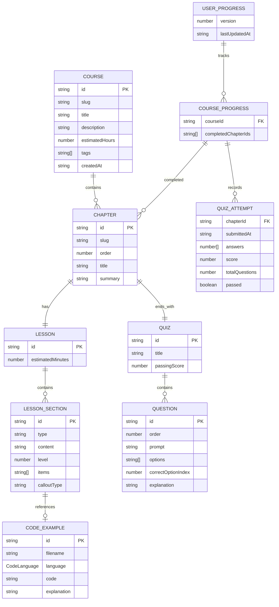

# Jozu — Content Data Model & Schema Design

## Mission Context

Mari Belajar is a frontend-only static SPA. There is **no database or backend API**. This document defines the TypeScript content model, entity relationships, content module organization, and business rules that govern progress gating.

---

## 1. Core Entities

### 1.1. `Course`

A top-level learning module.

| Field | Type | Description |
|-------|------|-------------|
| `id` | `string` | URL-safe unique identifier, e.g. `"cs-fundamentals"`. |
| `slug` | `string` | Human-readable URL segment. |
| `title` | `string` | Display title. |
| `description` | `string` | Short summary shown in course cards. |
| `chapters` | `Chapter[]` | Ordered list of chapters. |
| `estimatedHours` | `number` | Optional reading estimate. |
| `tags` | `string[]` | Optional categorization tags. |
| `createdAt` | `ISO date string` | Optional versioning metadata. |

### 1.2. `Chapter`

A unit within a course.

| Field | Type | Description |
|-------|------|-------------|
| `id` | `string` | Unique within the course, e.g. `"cara-kerja-komputer"`. |
| `slug` | `string` | URL segment. |
| `order` | `number` | 1-based position in the course. |
| `title` | `string` | Display title. |
| `summary` | `string` | Brief introduction. |
| `lesson` | `Lesson` | The prose + code content of this chapter. |
| `quiz` | `Quiz` | Multiple-choice quiz at the end. |

### 1.3. `Lesson`

The actual reading content of a chapter.

| Field | Type | Description |
|-------|------|-------------|
| `id` | `string` | Unique within the chapter. |
| `sections` | `LessonSection[]` | Ordered content blocks. |
| `estimatedMinutes` | `number` | Optional reading estimate. |

### 1.4. `LessonSection`

A subsection of a lesson.

| Field | Type | Description |
|-------|------|-------------|
| `id` | `string` | Unique within the lesson. |
| `type` | `"heading" \| "paragraph" \| "code-example" \| "callout" \| "list"` | Layout hint. |
| `content` | `string` | Markdown prose for text-based sections. |
| `codeExample` | `CodeExample` | Populated when `type === "code-example"`. |
| `level` | `number` | Heading level when `type === "heading"`. |
| `items` | `string[]` | List items when `type === "list"`. |
| `calloutType` | `"info" \| "warning" \| "tip"` | When `type === "callout"`. |

### 1.5. `CodeExample`

A runnable/readable code snippet.

| Field | Type | Description |
|-------|------|-------------|
| `id` | `string` | Unique within the lesson. |
| `filename` | `string` | Optional, e.g. `"main.ts"`. |
| `language` | `"js" \| "ts" \| "go"` | Syntax highlighting target. |
| `code` | `string` | Raw source code. |
| `explanation` | `string` | Markdown explanation of what the code does. |

### 1.6. `Quiz`

A set of questions at the end of a chapter.

| Field | Type | Description |
|-------|------|-------------|
| `id` | `string` | Unique within the chapter. |
| `title` | `string` | Optional heading. |
| `questions` | `Question[]` | Ordered questions. |
| `passingScore` | `number` | Required score to unlock next chapter. For M1 this is always `100`. |

### 1.7. `Question`

A single multiple-choice question.

| Field | Type | Description |
|-------|------|-------------|
| `id` | `string` | Unique within the quiz. |
| `order` | `number` | 1-based display order. |
| `prompt` | `string` | Question text, supports markdown. |
| `options` | `string[]` | Array of answer choices. |
| `correctOptionIndex` | `number` | Zero-based index into `options`. |
| `explanation` | `string` | Shown after submission, markdown. |

### 1.8. `UserProgress`

Persisted learner progress.

| Field | Type | Description |
|-------|------|-------------|
| `version` | `number` | Schema migration guard. Start at `1`. |
| `courseProgress` | `CourseProgress[]` | Per-course progress records. |
| `lastUpdatedAt` | `ISO date string` | Timestamp for optimistic conflict detection. |

### 1.9. `CourseProgress`

Progress scoped to a single course.

| Field | Type | Description |
|-------|------|-------------|
| `courseId` | `string` | Foreign key to `Course.id`. |
| `completedChapterIds` | `Set<string>` or `string[]` | Chapters the user has fully completed. |
| `quizAttempts` | `QuizAttempt[]` | Record of submitted attempts. |

### 1.10. `QuizAttempt`

A snapshot of one quiz submission.

| Field | Type | Description |
|-------|------|-------------|
| `chapterId` | `string` | Chapter the attempt belongs to. |
| `submittedAt` | `ISO date string` | When the attempt occurred. |
| `answers` | `number[]` | Zero-based selected option index per question, ordered by `question.order`. |
| `score` | `number` | Correct answers count. |
| `totalQuestions` | `number` | Total questions in the quiz. |
| `passed` | `boolean` | `true` when score === totalQuestions. |

---

## 2. TypeScript Interfaces (Pseudo-code)

```ts
// Language runtime for syntax highlighting and any future execution.
type CodeLanguage = 'js' | 'ts' | 'go';

// Lesson section variants discriminated by `type`.
type LessonSection =
  | { id: string; type: 'heading'; content: string; level: number }
  | { id: string; type: 'paragraph'; content: string }
  | { id: string; type: 'code-example'; codeExample: CodeExample }
  | { id: string; type: 'callout'; content: string; calloutType: 'info' | 'warning' | 'tip' }
  | { id: string; type: 'list'; items: string[] };

interface CodeExample {
  id: string;
  filename?: string;
  language: CodeLanguage;
  code: string;
  explanation: string;
}

interface Lesson {
  id: string;
  sections: LessonSection[];
  estimatedMinutes?: number;
}

interface Question {
  id: string;
  order: number;
  prompt: string;
  options: string[];
  correctOptionIndex: number;
  explanation: string;
}

interface Quiz {
  id: string;
  title?: string;
  questions: Question[];
  passingScore: number; // M1: always 100 (i.e., all correct)
}

interface Chapter {
  id: string;
  slug: string;
  order: number;
  title: string;
  summary: string;
  lesson: Lesson;
  quiz: Quiz;
}

interface Course {
  id: string;
  slug: string;
  title: string;
  description: string;
  chapters: Chapter[];
  estimatedHours?: number;
  tags?: string[];
  createdAt?: string;
}

interface QuizAttempt {
  chapterId: string;
  submittedAt: string;
  answers: number[];
  score: number;
  totalQuestions: number;
  passed: boolean;
}

interface CourseProgress {
  courseId: string;
  completedChapterIds: string[];
  quizAttempts: QuizAttempt[];
}

interface UserProgress {
  version: number;
  courseProgress: CourseProgress[];
  lastUpdatedAt: string;
}
```

---

## 3. Content Module Organization

Because the app is a static SPA, content is authored as TypeScript modules and bundled with the application. Content is read-only at runtime.

### 3.1. Folder Structure

```
src/
├── content/
│   ├── index.ts                 # Re-exports all courses; single content registry.
│   ├── types.ts                 # Shared content entity types (interfaces above).
│   └── courses/
│       └── cs-fundamentals/
│           ├── index.ts         # Exports the Course object and chapter re-exports.
│           ├── chapters/
│           │   ├── index.ts     # Re-exports chapter modules in display order.
│           │   ├── 01-cara-kerja-komputer/
│           │   │   ├── index.ts # Exports the Chapter object.
│           │   │   ├── lesson.ts
│           │   │   └── quiz.ts
│           │   └── 02-.../
│           └── meta.ts          # Course-level metadata (title, description, etc.).
```

### 3.2. Export Contract

- `src/content/index.ts` exports a `courses: Course[]` array and a `getCourseBySlug`, `getChapterBySlug` lookup helper type signatures.
- Each `chapter/index.ts` exports exactly one `chapter: Chapter` const.
- Each `lesson.ts` exports one `lesson: Lesson` const.
- Each `quiz.ts` exports one `quiz: Quiz` const.
- Lesson sections are authored inline within `lesson.ts` using typed objects, not raw markdown files, to keep type safety and simplify bundling on Cloudflare Pages.

### 3.3. Ordering Invariants

- Chapters are ordered by `order` ascending.
- Lesson sections are ordered by array position.
- Quiz questions are ordered by `order` ascending and rendered sequentially.

---

## 4. Entity Relationship Diagram (Mermaid)



---

## 5. Business Rules & Invariants

1. **First chapter unlocked**: The chapter with `order === 1` is always unlocked regardless of progress.
2. **Completion condition**: A chapter is marked completed only when its quiz is answered 100% correctly (`score === totalQuestions`).
3. **Sequential unlocking**: Chapter `N` (where `N > 1`) is unlocked only when chapter `N - 1` is in `completedChapterIds`.
4. **Quiz pass threshold**: `passingScore` is `100` for all Milestone 1 quizzes.
5. **Idempotent attempts**: Multiple failed attempts do not unlock the next chapter. A single passing attempt does.
6. **Read-only content**: Courses, chapters, lessons, and quizzes are constants loaded from TypeScript modules; they are never mutated at runtime.
7. **Progress persistence**: `UserProgress` is the only runtime-mutated structure and is persisted to `localStorage`.
8. **Schema migration**: A `version` field in `UserProgress` allows future agents to detect stale data and reset/migrate safely.

---

## 6. Module Boundaries

| Module | Responsibility |
|--------|----------------|
| `src/content/types.ts` | Shared content entity interfaces. |
| `src/content/courses/{course}/` | Course, chapter, lesson, quiz data. |
| `src/content/index.ts` | Content registry and read-only lookup helpers. |
| `src/stores/progressStore.ts` | Zustand store for `UserProgress`, actions, persistence, and derived unlock/completion state. |
| `src/lib/progress.ts` | Pure helper functions: `isChapterUnlocked`, `isChapterCompleted`, `computeQuizScore`, etc. |
| `src/lib/storage.ts` | localStorage read/write adapter with version checking and error handling. |

---

## 7. Validation Checklist for Implementation

- [ ] All interfaces compile without `any`.
- [ ] `passingScore` is typed as `100` or at least constrained to equal full marks.
- [ ] Chapter ordering is derived from the `order` field, not array index alone.
- [ ] Progress keys use stable `id` values, never array indices or display strings.
- [ ] localStorage serialization uses JSON and handles `QuotaExceededError` gracefully.
